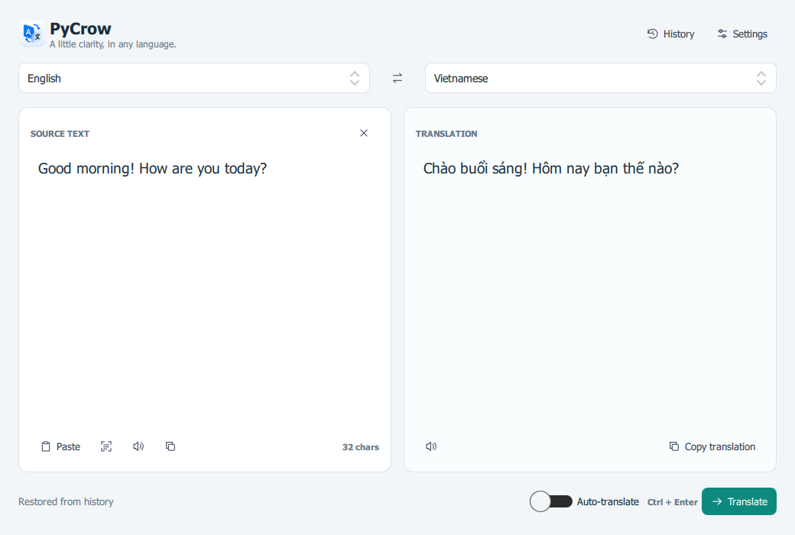

# Crow Translate

Crow Translate is a native desktop translation app for Windows, Linux, and macOS. It translates text you type, text on your clipboard, or text captured from a screenshot (OCR), and it can read translations aloud. It sits quietly in the system tray and pops up instantly with a global hotkey, so translating something never means switching apps or opening a browser tab.

This repository contains the **Python version** of Crow Translate — a from-scratch rewrite of the original C++/Qt Widgets application, built on **Python 3.11, PySide 6, and QML**. It is functionally newer and actively developed; the legacy C++ version remains available as a reference for full historical desktop behavior.

> Looking for the old C++ build? See the note in [Relationship to the C++ version](#relationship-to-the-c-version).

## Why Crow Translate

- **Translate without breaking flow.** A global hotkey translates whatever is on your clipboard, or whatever text you have selected anywhere on screen, in a small popup near your cursor — no window switching required.
- **More than just typed text.** Grab text straight from a screenshot with built-in OCR, or have translations read aloud with text-to-speech.
- **Runs in the background like a real desktop utility.** Single-instance enforcement, a system tray icon, and an optional "start with system" setting mean it behaves like part of your OS, not a webpage.
- **Both a GUI and a CLI.** Everything available in the desktop UI — translation, language detection, OCR — is also scriptable from the command line, with JSON output for automation.
- **Extensible by design.** Translation providers are a plugin interface. Google Cloud Translation ships built-in today; other providers can be added as Python packages without touching the core app.

## What it looks like



- Choose source and target languages above the text panels; use the middle button to swap them.
- Use **Translate** or **Ctrl+Enter** to translate, and **Ctrl+L** to focus the source editor.
- **Auto-translate** updates after a short typing pause and ignores outdated responses.
- Paste, clipboard-image OCR, speech, and copy actions sit beside the text they affect.
- Search **History** and select an entry to restore both texts and their languages.
- Settings are applied with **Save changes**; **Cancel** discards edits.
- Pin the quick-translate popup to keep it open when switching windows.

The preview uses sample text. The interface uses Qt Quick's Basic style for consistent custom controls across platforms.

## Feature summary

| Area | What it does |
|---|---|
| Translation | Google Cloud Translation Basic v2 with API-key authentication; pluggable providers. |
| Desktop UI | QML app with language selection, history, settings, OCR input, and speech controls. |
| Background operation | System tray icon, single-instance enforcement, optional "start with system". |
| Global hotkeys | Translate the clipboard, or select text anywhere and get a popup translation near the cursor. |
| CLI | Translation, language detection, file/stdin input, OCR, JSON output — scriptable and automatable. |
| Settings | Versioned TOML settings stored in the current user's application-data directory. |
| Extensibility | Translation-provider plugins via Python package entry points. |

## Relationship to the C++ version

Crow Translate began as a C++/Qt Widgets application. This Python/PySide 6/QML implementation is a newer, actively developed rewrite that covers the core GUI and CLI translation workflows, history, clipboard OCR, TTS, background/tray operation, global hotkeys, and provider plugins. A few legacy behaviors (see [Known limitations](#known-limitations)) aren't at full parity yet, so the C++ version remains the reference when complete legacy desktop behavior is required.

---

# Developer guide

The sections below cover setup, configuration, packaging, and internals for people building or extending Crow Translate.

## Requirements

- Python 3.11 or newer.
- Tesseract OCR for image recognition.
- A Google Cloud Translation API key.
- Windows optional dependencies (the `windows` extra) for global hotkeys.

## Development setup

### Linux or macOS

```bash
cd py_crow_tool
python3 -m venv .venv
source .venv/bin/activate
python -m pip install --upgrade pip
python -m pip install -e '.[test]'
pytest
py-crow-gui
```

### Windows PowerShell

```powershell
Set-Location py_crow_tool
py -3.11 -m venv .venv
.\.venv\Scripts\Activate.ps1
python -m pip install --upgrade pip
python -m pip install -e ".[windows,test]"
pytest
py-crow-gui
```

If PowerShell blocks activation, run the virtual-environment executables directly, for example `.\.venv\Scripts\py-crow-gui.exe`.

## Configure Google Cloud

Set an API key:

```powershell
$env:PY_CROW_GOOGLE_API_KEY = "your-api-key"
py-crow-gui
```

Alternatively, enter the key in Settings.

Settings can contain a plaintext API key. Keep the settings file private and never commit credentials.

## Background operation and global hotkeys

The GUI keeps running in the system tray after its window is closed (`Show`, `Translate clipboard`, and `Quit` are available from the tray menu). Enable **Start with system** in Settings to launch it automatically at login.

Two global hotkeys are configurable in Settings:

- **Clipboard hotkey** (default `ctrl+alt+t`): translates whatever is currently on the clipboard and shows the main window.
- **Quick-translate hotkey** (default `ctrl+alt+q`): copies the current text selection (by simulating Ctrl+C) and shows a small popup with the translation near the cursor, without switching focus to the main window.

Hotkey changes take effect after restarting the app.

Global hotkeys depend on the optional `keyboard` package (installed via the `windows` extra) and have real platform constraints:

- **WSL2 cannot run this feature at all**, even with `keyboard` installed: WSL2 has no access to the physical keyboard's raw input devices, so hotkeys silently never fire. Test hotkeys on native Windows (or native Linux with the permissions below), not inside WSL.
- On native Linux, `keyboard` needs permission to read `/dev/input` (typically root, or a user in the `input` group).
- On native Windows, if a hotkey still doesn't fire after confirming `keyboard` is installed: try running the app as Administrator (some elevated foreground windows block hooks from non-elevated processes), and check Windows Security's protection history — an unsigned PyInstaller build can be flagged for installing a low-level keyboard hook.
- If registration fails, the app logs the reason to stderr (visible when `pycrow.spec` is built with `console=True`, the default) and shows a tray notification.

## CLI

```bash
py-crow -s vi -t en "Xin chao"
py-crow --stdin -t fr --json
py-crow --file input.txt -t de
py-crow --detect "bonjour"
py-crow --ocr screenshot.png -t en
py-crow --provider google-v2 -t en "Hola"
```

| Option | Description |
|---|---|
| `-s, --source` | Source language code; defaults to `auto`. |
| `-t, --target` | Target language code; defaults to `en`. |
| `-p, --provider` | Force `google-v2`, or a plugin's provider id. |
| `--file` | Read UTF-8 source text from a file. |
| `--stdin` | Read source text from standard input. |
| `--ocr` | Recognize source text from an image. |
| `--detect` | Detect the language without translating. |
| `--json` | Print structured JSON. |

Run `py-crow --help` for the current interface.

## Project layout

| Path | Purpose |
|---|---|
| `src/py_crow_tool/core/` | Typed requests, results, language data, and provider protocol. |
| `src/py_crow_tool/providers/` | Google v2 provider and provider manager. |
| `src/py_crow_tool/services/` | History, OCR, TTS, desktop (hotkeys/tray/startup), and the shared async loop runner. |
| `src/py_crow_tool/qml/` | QML application interface (main window and the quick-translate popup). |
| `src/py_crow_tool/viewmodels.py` | QML-facing application state. |
| `src/py_crow_tool/cli.py` | Command-line entry point. |
| `tests/` | Unit, mocked-provider, and threading/async tests. |

## Provider plugins

Plugins are trusted Python packages registered in the `py_crow_tool.providers` entry-point group. A plugin exposes `ProviderPlugin` metadata and a factory implementing the `TranslationProvider` protocol. Users must explicitly list plugin IDs in `enabled_plugins` before they are loaded.

Plugins execute with the same permissions as the application. Install only trusted plugins.

## Testing

```bash
python -m pip install -e '.[test]'
pytest
python -m compileall -q src tests
```

Google tests use mocked HTTP transports. Live credential tests should be opt-in and use a dedicated test project with strict quotas.

## Windows packaging and deployment

Cutting a signed `PyCrowTool.exe` release (PyInstaller build, Tesseract bundling policy, code signing, publishing checklist, and packaging troubleshooting) is documented separately in [docs/WINDOWS_PACKAGING.md](docs/WINDOWS_PACKAGING.md) — reach for it only when preparing a release, not for regular development.

## Known limitations

- Tesseract must be installed separately unless a future package bundles it.
- Windows integration must be validated on Windows; Linux smoke tests cannot verify global hotkeys, startup registration, or the system tray implementation.
- Pixel-selected screen capture and all legacy C++ workflows are not yet at full parity.
- Credentials entered in Settings are not stored in Windows Credential Manager.

## License

The project is licensed under GPL-3.0-or-later.
